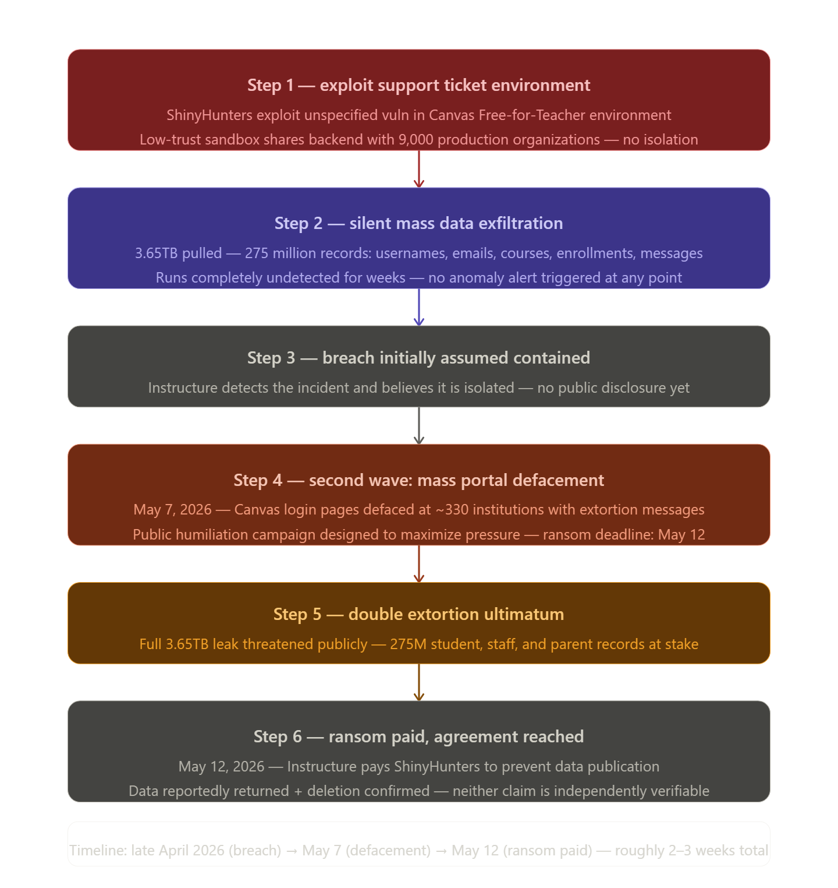

# Weekly Breach Investigation 15.05.2026

<aside>
🛡️

**Weekly Breach Investigation**

- Breach: **Instructure Reaches Ransom Agreement with ShinyHunters to Stop 3.65TB Canvas Leak**
- Date opened: May **12, 2026**
- Source: [https://thehackernews.com/](https://thehackernews.com/)
</aside>

## 1. Executive Summary

> **What happened?**
ShinyHunters hit Instructure the company behind Canvas, the learning management system used by thousands of universities and schools worldwide.
> 

> **Who was affected?**
They got in through a vulnerability in a low-priority part of the platform, the Free-for-Teacher support ticket feature, and walked out with 3.65 terabytes of data covering 275 million records
> 

> **What was the impact?**
When Instructure didn't move fast enough, the group came back on May 7th and defaced the login pages of around 330 institutions with ransom messages. By May 12th, Instructure had paid up.
> 

## 2. Attack Timeline

<aside>
⌛

- Late April 2026  The attackers found a weakness in the support ticket system inside Canvas's Free-for-Teacher environment. Nobody noticed. Over the following days they quietly pulled 3.65TB of data usernames, emails, course names, enrollment records, and internal messages from nearly 9,000 organizations.
</aside>

<aside>
⌛

- **May 7, 2026** ShinyHunters decided to turn up the pressure. They went back in and defaced the Canvas login portals at roughly 330 institutions, plastering them with extortion messages. They gave Instructure until May 12th to pay or they'd publish everything.
</aside>

<aside>
⌛

- **May 12, 2026**  Instructure went public and confirmed the breach. They announced they'd reached an "agreement" with the attackers a polite way of saying they paid the ransom. The group reportedly returned the data and provided digital confirmation they'd deleted it. Whether you trust that or not is a different story.
</aside>



## 3. MITRE ATT&CK Mapping

| **Tactic** | **Technique** | **ID** |
| --- | --- | --- |
| Initial Access | Exploit Public-Facing Application — support ticket vulnerability in the Free-for-Teacher environment | T1190 |
| Execution | Data from Information Repositories — bulk exfiltration of 275 million records across customer accounts | T1213 |
| Impact | Defacement of Canvas login portals across 330 institutions + Financial Extortion | T1491/ T1657 |

## 4. Detection Opportunities

<aside>
💡

- **Log source:** Application logs from the support ticket system, API access logs, database query logs for bulk reads, web server logs for login portal modifications, and data egress monitoring at the network boundary
</aside>

<aside>
💡

- **Detection rule:** You want to be alerting on a few things here. First  any bulk read or export from the support ticket database that's way outside normal volume. Second  API calls pulling large amounts of records in a short time window, especially outside business hours. Third any unauthorized changes to the HTML or content of the Canvas login pages. And fourth  privileged sessions being created from unusual IPs or user agents after the support ticket system is accessed.
</aside>

<aside>
💡

- **IOCs:** Abnormal outbound data transfer in the terabyte range, unauthorized API queries to the support ticket backend, web page content changes on Canvas-hosted login portals, new privileged sessions created following support system activity.
</aside>

## 5. Recommended Mitigations

> Free-tier and sandbox environments should never share backend infrastructure or privileged access pathways with production systems. That's the root of this breach. If a Free-for-Teacher account can reach the data of 9,000 paying organizations, the architecture is broken at the foundation.
> 

> Put a hard limit on how much data can be exported through any single API session or support tool. 3.65TB doesn't move in silence  if there had been proper egress monitoring with volume thresholds, someone would have seen it.
> 

> Rotate everything after a breach  access tokens, API keys, internal credentials, session tokens. And going forward, enforce short-lived tokens so that stolen credentials have a very small window to do damage.
> 

## 6. Analyst Notes

> What I learned
> 
> 
> <aside>
> 📋
> 
> - the weakest point in any SaaS platform is almost never the main product it's the free tier, the demo environment, the sandbox, the "low risk" feature that nobody's watching. Free-for-Teacher sounds harmless. But it was sitting on the same backend as 9,000 institutions and nobody treated it with the same level of scrutiny as the production environment. That's the lesson here.
> </aside>
> 

> What surprised me
> 
> 
> <aside>
> 📋
> 
> - the second wave. The initial breach was bad enough, but coming back two weeks later and defacing the login pages of 330 universities that's not just extortion, that's a public humiliation campaign designed to maximize pressure. It worked. Instructure paid.
> </aside>
> 

> What I’d investigate further with internal access
> 
> 
> <aside>
> 📋
> 
> - the support ticket system's permission model. How did a vulnerability in that feature give access to 275 million records across the entire customer base? That means either the vulnerability allowed privilege escalation from a low-trust context into the main database, or the support system had way too much access to begin with both of which are serious architectural failures that go beyond just patching the bug.
> 
> The ransom was paid, the data was supposedly deleted, and the company says no individual customers will be separately extorted. But the 275 million people whose data was taken students, teachers, university staff  they're now in phishing targeting lists. The real damage from this breach hasn't fully shown up yet.
> </aside>
> 

```jsx
@Emad Al-Baadani
```